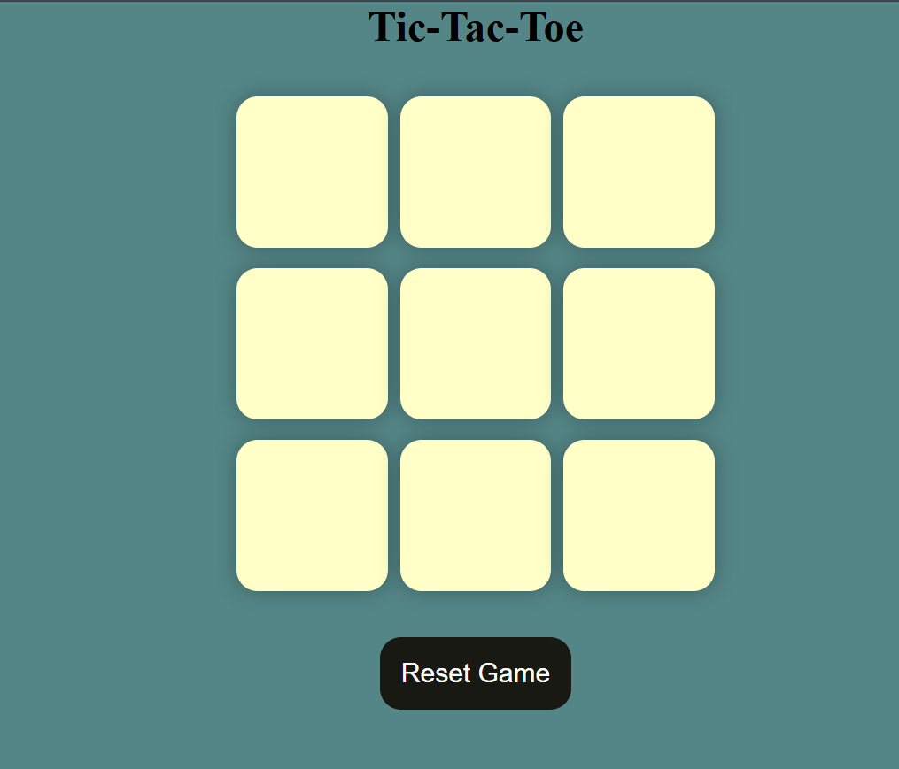
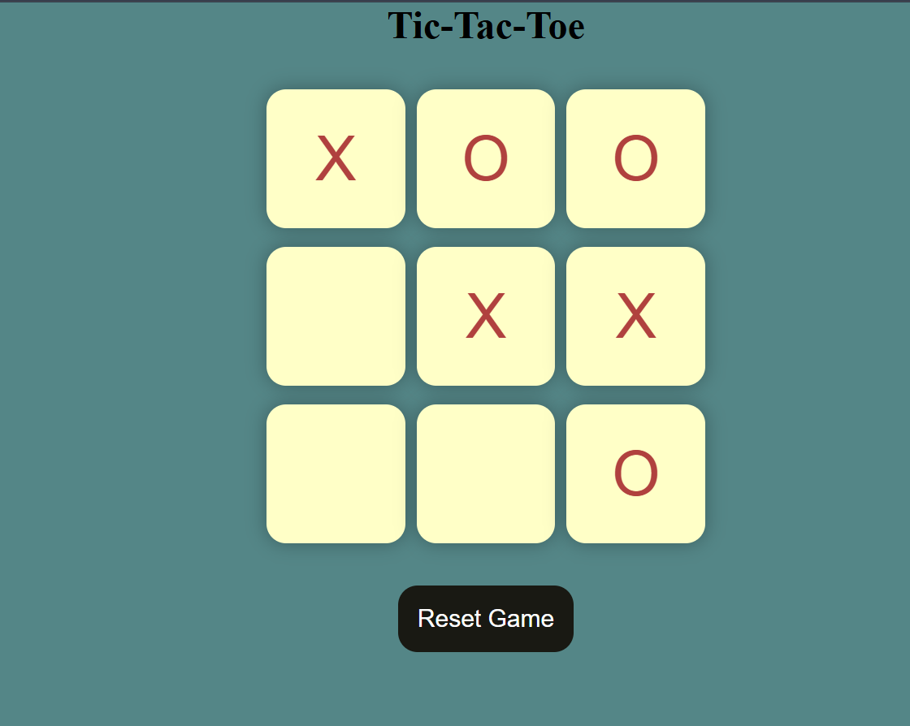
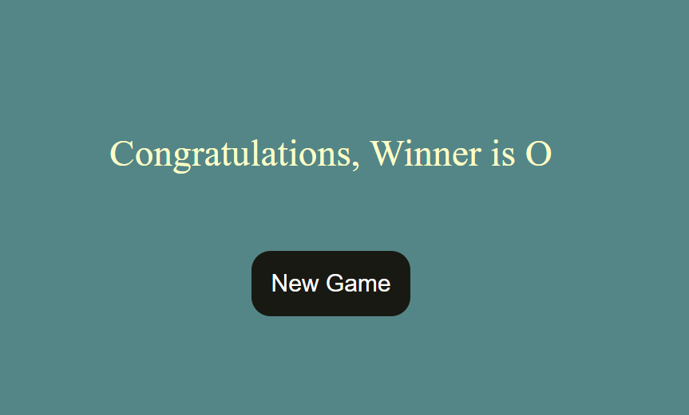
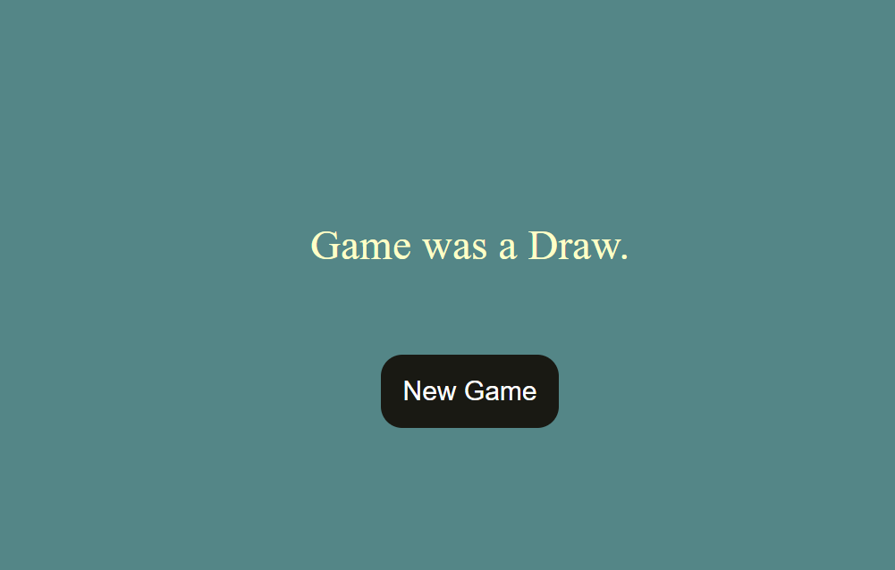

# ❌⭕ Tic-Tac-Toe Game

A classic 2-player **Tic-Tac-Toe (X and O) game built with HTML, CSS, and JavaScript. This project showcases basic DOM manipulation, game logic, and interactive UI using vanilla JS.

---

## 📸 Screenshots

### 🧩 Main Game Interface

### 🕹️ Live Gameplay

Here’s what the game looks like while playing:

### 🟢 O Wins!

### 🤝 Draw State

---

## 🧩 Features

- 🔁 Turn-based gameplay between Player X and Player O
- 🧠 Win detection logic for rows, columns, and diagonals
- 💥 Displays the winner or a draw
- 🔄 Reset button to play again
- 💻 Fully responsive layout

---

## 🚀 Technologies Used

- HTML5
- CSS3
- JavaScript (ES6)
